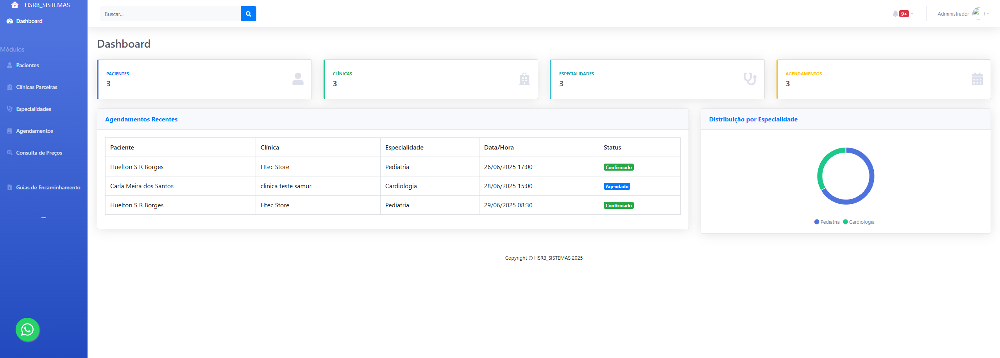
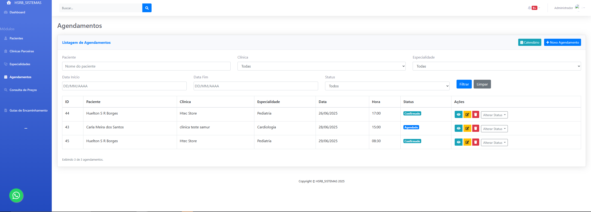

# 🏥 Sistema de Atendimento Clínico - HSRB_SISTEMAS

Este é um sistema web desenvolvido para auxiliar instituições de saúde no **gerenciamento de pacientes, agendamentos, especialidades e clínicas parceiras**. O projeto está sendo disponibilizado como código aberto, visando contribuir com a comunidade de desenvolvedores e facilitar o aprendizado de quem está ingressando na área da tecnologia.

## ⚙️ Funcionalidades

- Cadastro de pacientes
- Agendamento de consultas por especialidade e clínica
- Emissão de guias de encaminhamento
- Cadastro de clínicas parceiras
- Cadastro de especialidades
- Consulta de preços por tipo de atendimento
- Dashboard com gráficos e resumos
- Login e autenticação de usuários

## 💻 Tecnologias Utilizadas

- PHP (Back-end)
- MySQL (Banco de Dados)
- HTML, CSS e JavaScript (Front-end)
- Bootstrap (Interface responsiva)
- VS Code (Ambiente de desenvolvimento)

## 🖼️ Telas do Sistema

### 🔐 Tela de Login


### 📊 Dashboard Principal


### 📅 Tela de Agendamentos



## 📦 Instalação

1. Clone o repositório:
   ```bash
   git clone https://github.com/hueltonsantos/HSRB_SISTEMAS.git


1. Configure seu servidor local (Apache + MySQL).

2. Crie o banco de dados a partir do arquivo em Banco_sql/ (script de criação).

3. Ajuste o arquivo config.php com os dados do seu banco.

4. Acesse login.php no navegador e faça login.

🤝 Contribuição
Quer contribuir? Fique à vontade para enviar pull requests ou abrir issues com sugestões e melhorias. Toda contribuição é bem-vinda!

📜 Licença
Este projeto está licenciado sob a licença MIT – veja o arquivo LICENSE para mais detalhes.

👨‍💻 Autor
Huelton dos Santos Ribeiro Borges
🔗 GitHub: https://github.com/hueltonsantos
✉️ Contato: 
[linkdin] www.linkedin.com/in/huelton-santosdvs
[contato@huelton.com] Email: hueltonti@gmail.com
